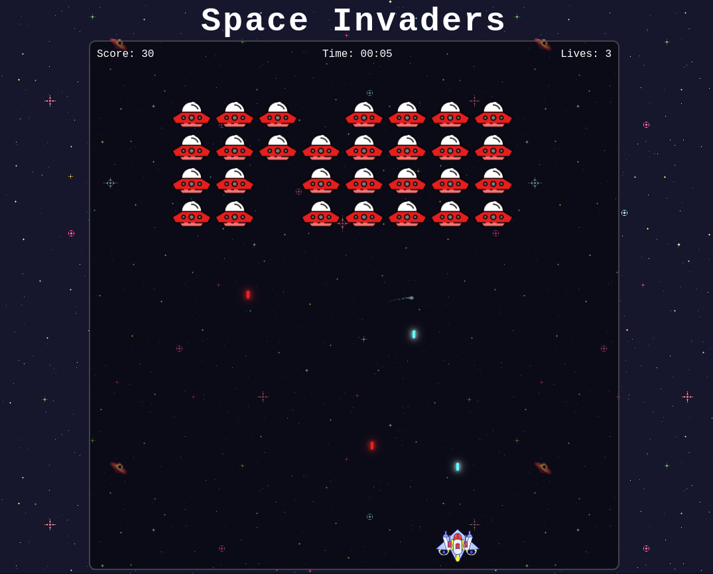

# Space Invaders

A vanilla JavaScript implementation of the classic Space Invaders game, optimized for 60 FPS performance.




## Authors

- Yassine El mach
- Hamza Maach

## Core Features

- 60 FPS gameplay with no frame drops
- Smooth keyboard controls
- Pause menu (Continue/Restart)
- Score tracking (Time, Points, Lives)
- Performance-optimized rendering using minimal layers
- Pure JavaScript/DOM implementation (no Canvas/frameworks)

## Project Structure

```
make-your-game/
├── images/          # Game sprites and assets
├── style/           # CSS files
├── script/
│   ├── modules/     # Game logic modules
│       ├── alien.js       # Alien entity logic
│       ├── alienGrid.js   # Alien formation management
│       ├── gameState.js   # Game state/scoring system
│       ├── spaceShip.js   # Player ship controls
│       └── visuals.js     # Visual effects/animations
│   └── main.js      # Entry point  
├── index.html       # Main game page
└── README.md        # Documentation
```

## Technologies

- HTML5 & CSS3
- Vanilla JavaScript 
- requestAnimationFrame API
- DOM manipulation

## Performance Optimization

- Minimal DOM layers
- Transform/opacity for animations
- Optimized collision detection
- Performance monitoring via Dev Tools

## Setup

1. Clone repository:
```bash
git clone https://github.com/yassinalmach/make-your-game
cd make-your-game
```

2. Open `index.html` in a modern browser